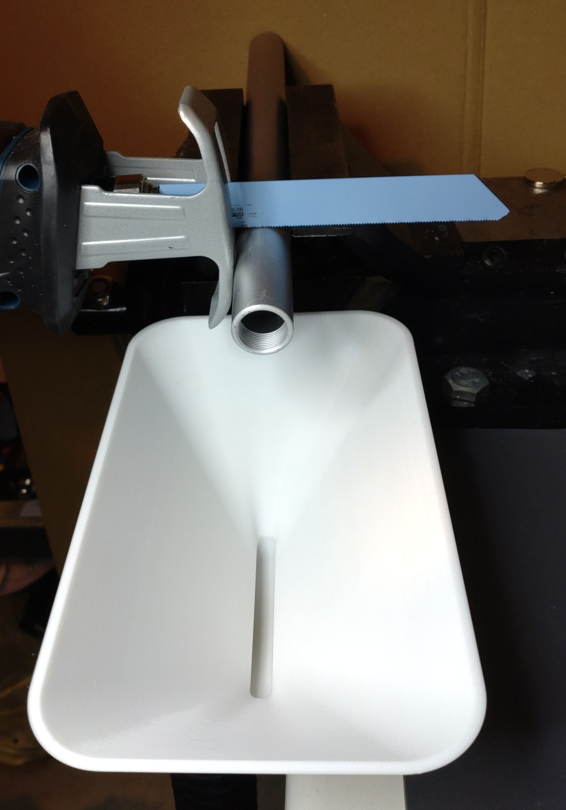

# Suction-funnel-for-Bosch-click-clean-system
3D printable suction funnel for Bosch click&amp;clean system. Created in Rhino 8.

Since I have the Bosch cordless vacuum cleaner with Click&Clean connection and have redrawn the connection for it, I am always finding new applications. 
I recently had to cut a stainless steel rod with a reciprocating saw. To do this, I clamped the bar in the vice. The chips flew everywhere when I was cutting. 
For that, i designed a funnel with a suction connection for the Click&Clean system that can be clamped to the workbench (28 mm thick worktop). The vacuum cleaner is attached at the bottom and everything stays clean.

Requirements:
* 3D printer 
* Filament of your choice (i used PETG)

## View

 

  

 
